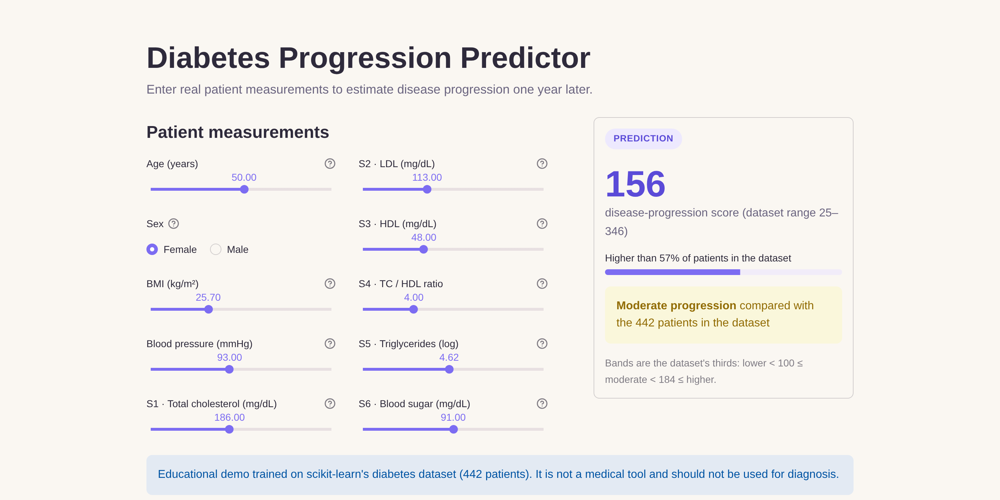

# Diabetes Progression Predictor

A Streamlit web app that estimates **diabetes disease progression one year after baseline** from ten patient measurements, using a scikit-learn pipeline trained on the classic diabetes dataset (Efron et al., 2004).

**Live demo:** <your-app>.streamlit.app <!-- replace after deploying -->

 <!-- add a screenshot, or delete this line -->

> **Educational project only.** This is not a medical tool and must not be used for diagnosis or treatment decisions.

## Features

- **Real-world units.** Inputs are age in years, BMI, blood pressure in mmHg and blood-test values, not sklearn's pre-scaled numbers.
- **Realistic inputs.** Every slider is bounded by the dataset's min/max and starts at the median.
- **Live prediction.** The score updates instantly as you move a slider.
- **Context for the score.** Shows the percentile against the dataset's 442 patients, plus a lower / moderate / higher band based on the dataset's thirds.
- **Self-contained model.** Cleaning, encoding and scaling live inside the saved pipeline, so the app passes raw values straight to it.

## Input features

| Feature | Meaning | Unit |
|---|---|---|
| age | Age | years |
| sex | Sex (Female / Male, see note below) | – |
| bmi | Body mass index | kg/m² |
| bp | Average blood pressure | mmHg |
| s1 | Total serum cholesterol (TC) | mg/dL* |
| s2 | Low-density lipoproteins (LDL) | mg/dL* |
| s3 | High-density lipoproteins (HDL) | mg/dL* |
| s4 | Total cholesterol / HDL ratio | ratio |
| s5 | Log of serum triglycerides | log |
| s6 | Blood sugar (glucose) | mg/dL* |

\*Units are inferred from typical value ranges; the dataset documentation does not state them.

**Target:** a quantitative measure of disease progression one year after baseline (range 25–346).

**Sex coding:** the dataset stores sex as 1 or 2 without documenting which is which. Group 1 has markedly higher HDL (54 vs 45 mg/dL, p < 10⁻¹⁶) and lower blood pressure, both well-known female patterns, so the app uses **1 = Female, 2 = Male**. This is inferred from the data, not officially documented.

## Model

| Step | Details |
|---|---|
| Data | `sklearn.datasets.load_diabetes(scaled=False)`: 442 patients, 10 features, no missing values |
| Preprocessing | Median imputation → standard scaling; one-hot encoding for sex |
| Feature engineering | Polynomial / interaction features tested; cross-validation did not keep them |
| Models compared | Lasso and Random Forest, tuned with 5-fold `GridSearchCV` |
| Selection | Best cross-validation R² (not test score, to avoid overfitting the hold-out set) |
| Final model | **Lasso (alpha = 0.1)**, refit on all 442 rows |
| Performance | CV R² ≈ 0.48 · test R² ≈ 0.46 · MAE ≈ 43 points |

An R² of about 0.45–0.50 is typical for this dataset: the ten baseline measurements explain roughly half of the variation in progression.

## Run locally

```bash
git clone https://github.com/shweyeewinn/diabetes-progression-predictor.git
cd diabetes-progression-predictor
pip install -r requirements.txt

python train_model.py        # optional: rebuilds diabetes_pipeline.pkl
streamlit run app.py
```

Then open http://localhost:8501.

## Project structure

```
├── .streamlit/config.toml    # app theme
├── app.py                    # Streamlit app
├── train_model.py            # reproducible training pipeline
├── diabetes_pipeline.pkl     # trained model (preprocessing + Lasso)
├── requirements.txt          # pinned dependencies
└── LICENSE                   # MIT
```

## Tech stack

Python 3.12 · Streamlit · scikit-learn · pandas · NumPy

## Data source

Efron, B., Hastie, T., Johnstone, I. & Tibshirani, R. (2004). *Least Angle Regression*. Annals of Statistics, 32(2), 407–499. Loaded via scikit-learn's [`load_diabetes`](https://scikit-learn.org/stable/modules/generated/sklearn.datasets.load_diabetes.html).

## License

[MIT](LICENSE) © Shwe Yee Winn
